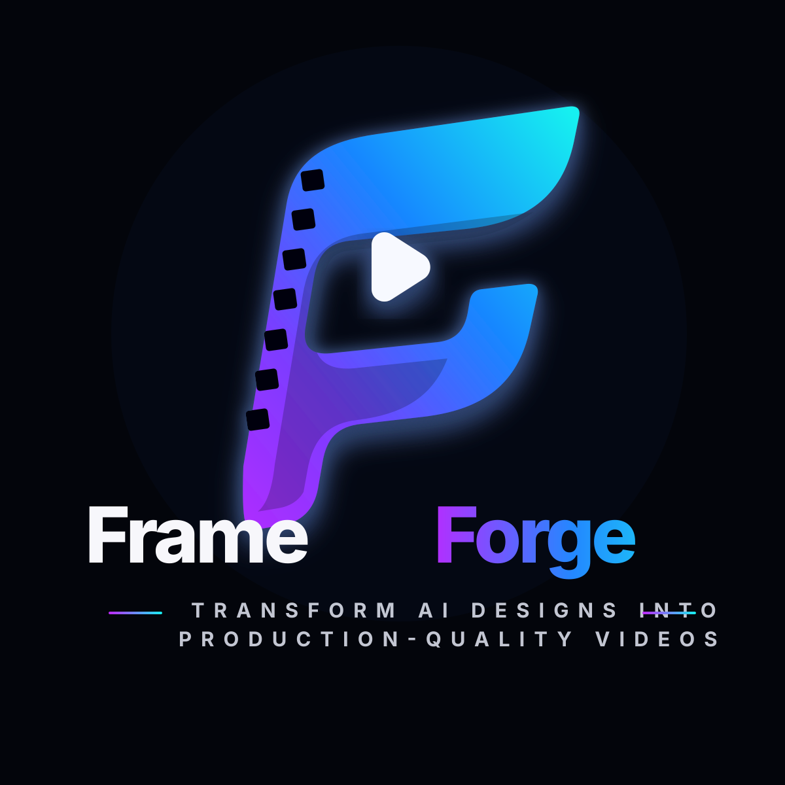
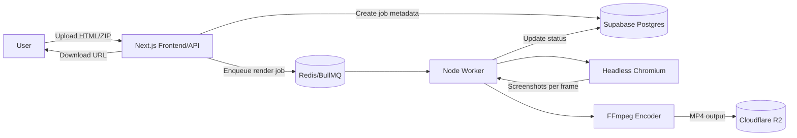

# FrameForge

<p align="center">
  
</p>


FrameForge is a planned HTML-to-MP4 rendering platform for Claude, React, and plain HTML/CSS/JS animations. The target product lets users upload an animation project, enqueue a render, and download a deterministic MP4 generated by a headless Chromium plus FFmpeg worker pipeline.

This repository currently contains the implementation blueprint and delivery plan for the MVP.

## Target MVP

- Upload a single HTML file or zipped project.
- Select output resolution and frame rate presets.
- Render frames deterministically in a sandboxed headless browser.
- Encode frames to H.264 MP4 with FFmpeg.
- Track job status and provide a download link when complete.

## Proposed Architecture



## Documentation

- [Product requirements and roadmap](docs/prd.md)
- [Technical architecture](docs/architecture.md)
- [Implementation backlog](docs/backlog.md)
- [Brand assets](docs/brand.md)

## Recommended Initial Stack

- **Frontend/API:** Next.js on Vercel or another Node-compatible host.
- **Queue:** BullMQ backed by Redis or Upstash Redis.
- **Worker:** Node.js, Playwright Chromium, FFmpeg.
- **Database/Auth:** Supabase Postgres and Auth.
- **Object Storage:** Cloudflare R2 or S3-compatible storage.
- **Monitoring:** Sentry plus structured worker logs.

## Local Development

Run the initial web shell and worker smoke test with Node.js 22 or newer:

```bash
npm test
npm run render:sample
npm run start:web
```

Current scaffold:

1. `apps/web` contains a zero-dependency Node web shell with a health check and branded landing page.
2. `apps/worker` contains a sample deterministic frame writer that produces SVG frames under `storage/outputs`.
3. `packages/shared` contains shared job statuses, presets, and job construction helpers.
4. `samples/basic-render` contains a minimal HTML animation exposing the planned `window.__FRAMEFORGE_RENDER_FRAME__` hook.

Next implementation milestones are browser-based screenshot capture, queue persistence, upload handling, and FFmpeg MP4 encoding.

## Testing

The default test suite uses Node's built-in test runner and covers shared job helpers, the worker sample-render path, and the web server health/landing responses:

```bash
npm test
```

Use `npm run render:sample` for a manual worker smoke run. Generated frames are written under `storage/outputs`, which is intentionally ignored by Git.
