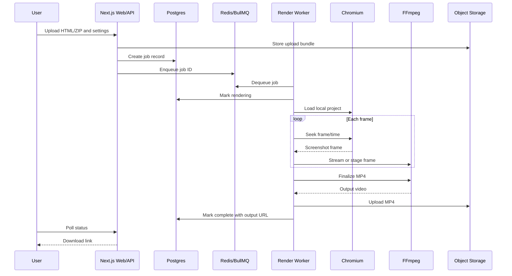

# FrameForge Technical Architecture

## System Overview

FrameForge is designed as a queue-based rendering system. API requests stay short-lived, while long-running browser rendering and FFmpeg encoding execute in workers.



## Core Components

### Web/API

Responsibilities:

- Authenticate users when auth is enabled.
- Accept uploads and render settings.
- Validate file types, size limits, duration limits, resolution presets, and frame-rate presets.
- Persist job metadata.
- Enqueue jobs.
- Serve status pages and download links.

Recommended implementation:

- Next.js app router or a dedicated Express/NestJS API.
- Direct-to-object-storage uploads for large files when possible.
- Server-side signed URL generation for private outputs.

### Queue

Responsibilities:

- Decouple user-facing requests from long-running render jobs.
- Provide retries, backoff, concurrency control, and job locking.

Recommended implementation:

- BullMQ with Redis.
- Per-preset queues if heavy 4K jobs need separate concurrency limits.
- Dead-letter handling for repeated failures.

### Worker

Responsibilities:

- Pull queued jobs.
- Download and unpack upload bundles into a per-job temporary directory.
- Launch headless Chromium with strict settings.
- Render each frame deterministically.
- Encode output video through FFmpeg.
- Upload final MP4 and update job state.
- Clean up temporary files.

Recommended implementation:

- Node.js with Playwright.
- `child_process.spawn` for FFmpeg to avoid buffering large outputs in memory.
- A hard timeout around the whole job and around each frame capture.
- Structured logs with job ID, phase, frame index, and elapsed time.

## Animation Render Contract

For reliable output, uploaded HTML should expose an optional deterministic render hook:

```js
window.__FRAMEFORGE_RENDER_FRAME__ = async ({ frame, fps, timeMs, width, height }) => {
  // Seek animation libraries, React state, GSAP timelines, or custom canvas code here.
};
```

Worker behavior:

1. Load the page from a local file URL or local static server.
2. Set viewport dimensions.
3. For each frame, call the hook if present.
4. Wait for pending fonts/images and the next animation frame.
5. Capture a screenshot.
6. Stream or write the frame for FFmpeg.

If no hook is present, the worker can fall back to elapsed-time capture, but that mode should be labeled less deterministic.

## FFmpeg Encoding

Initial H.264 command shape:

```bash
ffmpeg -y \
  -framerate 30 \
  -i frame_%06d.png \
  -c:v libx264 \
  -preset medium \
  -crf 18 \
  -pix_fmt yuv420p \
  output.mp4
```

Future encoder presets:

- CPU H.264: `libx264` with CRF-based quality.
- CPU H.265: `libx265` for smaller files at slower encoding speed.
- NVIDIA GPU: `h264_nvenc` or `hevc_nvenc` when the worker has compatible hardware.

## Security Controls

- Run worker jobs in isolated containers or short-lived machines.
- Never render arbitrary remote URLs in MVP.
- Serve uploaded files from a local static server with a strict root directory.
- Block or allowlist outgoing browser requests.
- Enforce max upload size, max output duration, max resolution, and max frames.
- Kill jobs that exceed time, CPU, memory, or disk budgets.
- Store secrets only in environment variables or managed secret stores.
- Sanitize logs so user HTML is not dumped into shared log sinks.

## Storage Model

Suggested object layout:

```text
uploads/{userId}/{jobId}/source.zip
outputs/{userId}/{jobId}/output.mp4
logs/{userId}/{jobId}/worker-summary.json
```

Suggested job fields:

| Field | Purpose |
| --- | --- |
| `id` | Stable job ID. |
| `user_id` | Owner, nullable before auth. |
| `status` | `queued`, `rendering`, `encoding`, `complete`, `failed`, or `cancelled`. |
| `settings` | JSON render settings. |
| `upload_url` | Object path for source bundle. |
| `output_url` | Object path or signed URL for finished MP4. |
| `progress_current` | Current frame or phase progress. |
| `progress_total` | Total frames or phase target. |
| `error_code` | Machine-readable failure code. |
| `error_message` | User-safe failure summary. |
| `created_at` | Creation timestamp. |
| `updated_at` | Last update timestamp. |

## Deployment Strategy

The architecture should support multiple deployment profiles:

### Local Development

- Web app on localhost.
- Worker process on localhost.
- Redis through Docker Compose.
- Local filesystem or MinIO for object storage.

### Low-Cost MVP

- Frontend/API on a Node-compatible platform.
- Worker on a small VM or container host with enough memory for Chromium.
- Managed Redis-compatible queue.
- Managed Postgres.
- S3-compatible object storage.

### Scale Profile

- Multiple workers by preset and priority.
- Dedicated GPU workers for high-throughput encoding.
- Queue autoscaling based on backlog age.
- CDN-backed output delivery.
